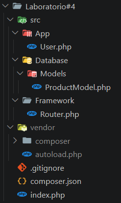
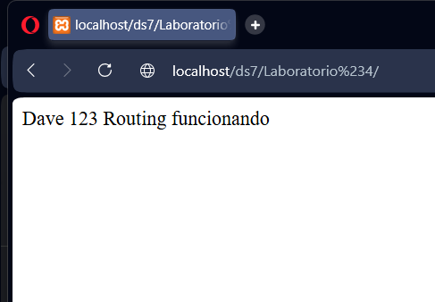
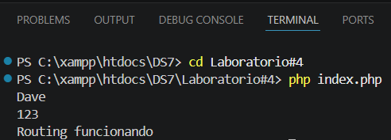

## 📖 Descripión 
Este proyecto demuestra la implementación de carga automática de clases en PHP utilizando Composer bajo el estándar PSR-4.

## ⚙️ Guía de Instalación
Para poder ejecutar este proyecto se deben seguir los siguientes pasos:
####    1. Clonar el Repositorio
``` bash
git clone https://github.com/tu-usuario/tu-repositorio.git cd tu-repositorio
```

####    2. Instalar dependencias y generar autoload
``` bash
composer install
```
En caso de no necesitarlo, directamente hacer:
``` bash
composer dump-autoload
```
####    3. Ejecutar el proyecto
Se debe tomar en cuenta que la carpeta del proyecto debe estar dentro de las carpetas xampp\htdocs. Luego se ejecutar de dos formas:
##### En navegador:
``` bash
http://localhost/tu-proyecto/
```
##### En un IDE como Visual Studio Code, localizar la terminal y usar:
``` bash
php index.php
```

## 🗂️ Estructura de Carpetas


La imagen muestra la forma en que se deben estructurar las carpetas para lograr una correcta ejecución del estándar PSR-4. Sin embargo, se debe también tener en cuenta lo siguiente:
#### 1. Definir el composer.json:
Cada clase debe estar dentro del composer para asegurar su funcionamiento, ya que este permite establecer la dirección de cada clase en la estructura de carpetas. Se define así:
``` bash
{
    "autoload": {
        "psr-4": {
            "App\\": "src/App/",
            "Database\\": "src/Database/",
            "Framework\\": "src/Framework/"
        }
    }
}
```

#### 2. Namespaces dentro de cada clase
Es necesario que cada clase defina su namespace correctamente para que el composer.json pueda encontrarlas. Se define así para cada clase:
``` bash
namespace App;
namespace Database\Models;
namespace Framework;
```

#### 3. Ejecutar en la terminal el autoload:
``` bash
composer dump-autoload
```
Este comando permite que composer genere archivos dentro de vendor que funcionan como un mapa interno de clases, evitando que composer las tenga que buscar en cada ejecución y de esta forma el sistema se ejecuta más rápido.

## ▶️ Prueba de Ejecución
#### 1. En el navegador:


#### 2. En la terminal


## 🧠 Conclusiones Técnicas
#### 1. Mantenibilidad
Al usar el estándar PSR-4 se habilita la integración sencilla de nuevas clases sin modificaciones complejas. Solo se deben colocar en su carpeta, establecer la ruta en el composer.json y definir su namespace.

#### 2. Eficiencia de Memoria
La carga automática implementa el concepto de "Lazy Loading", esto significa que las clases solo se van a cargar cuando se necesitan, reduciendo el consumo de memoria y aportando un rendimiento mejor.

#### 3. Estandarización
Al seguir el estándar PSR-4 también se logra tener un código más organizado, facilitando su lectura y mejorando el trabajo en equipo. 

## 🧹 Higiene del Repositorio
El proyecto incluye un archivo .gitignore configurado para excluir carpetas o archivos no necesitados en el repositorio, como lo es la carpeta vendor.
